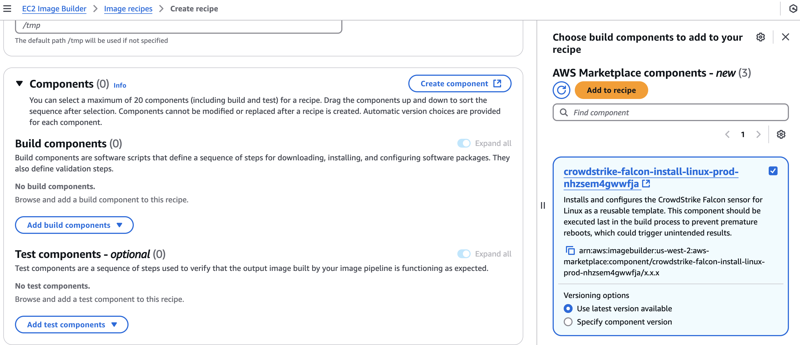

   

# AWS EC2 Image Builder Component for CrowdStrike Falcon Sensor

This repository contains an AWS EC2 Image Builder component for Linux that installs and configures the CrowdStrike Falcon sensor, preparing it as a master/golden image for your AWS environment.

The component automates the installation of the CrowdStrike Falcon sensor on an EC2 instance during the image building process. It's designed to be the final step in your image pipeline to ensure proper configuration and prevent interference from system reboots.

## Prerequisites

Before using this component, ensure the following requirements are met:

1. **API Credentials**: Store your CrowdStrike API credentials securely in either AWS Secrets Manager or AWS Systems Manager Parameter Store as SecretStrings.

> [!TIP]
> For more information on generating API keys and storing them securely, see [API Credentials](#api-credentials) below.

2. **IAM Permissions**: The IAM role used for the Image pipeline must have the necessary IAM permissions to access the stored credentials.

## API Credentials

The component uses the CrowdStrike API to download the sensor onto the target instance. It is highly recommended that you create a dedicated API client for the this component.

### Generate API Keys

1. In the CrowdStrike console, navigate to **Support and resources** > **API Clients & Keys**. Click **Add new API Client**.
2. Add the following API scopes:

    | Scope                      | Permission | Description                                                                   |
    | -------------------------- | ---------- | ----------------------------------------------------------------------------- |
    | **Installation Tokens**    | *READ*     | Allows the component to pull installation tokens from the CrowdStrike API.    |
    | **Sensor Download**        | *READ*     | Allows the component to download the sensor from the CrowdStrike API.         |
    | **Sensor update policies** | *READ*     | Allows the component to read sensor update policies from the CrowdStrike API. |

3. Click **Add** to create the API client. The next screen will display the API **CLIENT ID**, **SECRET**, and **BASE URL**. You will need all three for the next step.

    

> [!NOTE]
> This page is only shown once. Make sure you copy **CLIENT ID**, **SECRET**, and **BASE URL** to a secure location.

### Base URL Mapping

The CrowdStrike API base URL is determined by the region where your CrowdStrike tenant is hosted. Use the following table to map the CrowdStrike API base URL to the Cloud Region to be used by the component:

| BASE URL                                 | CLOUD REGION |
| ---------------------------------------- | ------------ |
| `https://api.crowdstrike.com`            | **us-1**     |
| `https://api.us-2.crowdstrike.com`       | **us-2**     |
| `https://api.eu-1.crowdstrike.com`       | **eu-1**     |
| `https://api.laggar.gcw.crowdstrike.com` | **us-gov-1** |

### Store API Credentials

Store the CrowdStrike API credentials in AWS Secrets Manager or AWS Systems Manager Parameter Store as SecretStrings. The component will use these credentials to authenticate with the CrowdStrike API.

Using AWS Secrets Manager

To use Secrets Manager as your secret backend, you must enter `SecretsManager` as the value for the `SecretStorageMethod` parameter when using the component.

Use the following as an example to create a secret with the following key/value pairs:

| Key          | Value                                                            | *Example*                        |
| ------------ | ---------------------------------------------------------------- | -------------------------------- |
| ClientId     | The **CLIENT ID** from [Generate API Keys](#generate-api-keys).  | 123456789abcdefg                 |
| ClientSecret | The **SECRET** from [Generate API Keys](#generate-api-keys).     | 123456789abcdefg123456789abcdefg |
| Cloud        | The **CLOUD REGION** from [Base URL Mapping](#base-url-mapping). | us-2                             |

You can use any secret name you like, as long as you pass in the secret name when using the component.

> [!IMPORTANT]
> The keys must match the table above.

Using AWS Parameter Store

To use Parameter Store as your secret backend, you must enter `ParameterStore` as the value for the `SecretStorageMethod` parameter when using component.

Use the following as an example to create the parameters in Parameter Store:

| Default Parameter Name           | Parameter Value                                                  | Parameter Type | *Example*                        |
| -------------------------------- | ---------------------------------------------------------------- | -------------- | -------------------------------- |
| /CrowdStrike/Falcon/ClientId     | The **CLIENT ID** from [Generate API Keys](#generate-api-keys).  | SecureString   | 123456789abcdefg                 |
| /CrowdStrike/Falcon/ClientSecret | The **SECRET** from [Generate API Keys](#generate-api-keys).     | SecureString   | 123456789abcdefg123456789abcdefg |
| /CrowdStrike/Falcon/Cloud        | The **CLOUD REGION** from [Base URL Mapping](#base-url-mapping). | SecureString   | us-2                             |

> [!NOTE]
> You can use any parameter name you like, as long as you pass in the correct names for the SSM Parameters in the component.

## Installation

To use this component in your EC2 Image Builder pipeline:

### Subscribe to the Component

1. Navigate to the **Discover products** section under AWS Marketplace in the EC2 Image Builder console.

1. Select the **Components** tab and search for ***CrowdStrike Falcon Sensor***.

1. Select **View subscription options** and select **Subscribe**.
    > :warning: Please note it can take a few minutes for the subscription to be processed and available for use.

1. Once you have subscribed you will see the **Status** change to ***Subscribed***. You can now use the component in your image recipes.

### Add Component to Image Recipe

1. Create a new image recipe or edit an existing one in the EC2 Image Builder console.

1. In the **Components** section, select **Add build components** and choose **AWS Marketplace**.

1. Find the CrowdStrike Falcon Sensor component, select it and click **Add to recipe**.

1. Configure the component according to your environment's requirements by providing the necessary parameters. For more information about component parameters, refer to the [Parameters](#component-parameters) section below. At minimum, you will need to provide:
   - `SecretStorageMethod`: The secret backend to use which holds your API credentials (**SecretsManager** or **ParameterStore**)
     - If using **SecretsManager**:
       - `SecretsManagerSecretName`: The name of the AWS Secrets Manager secret containing your CrowdStrike API credentials
     - If using **ParameterStore**:
       - `SSMFalconCloud`: The SSM Parameter Store name that contains the Falcon Cloud Region for the Falcon API credentials
       - `SSMFalconClientId`: The SSM Parameter Store name that contains the Falcon Client Id for the Falcon API credentials
       - `SSMFalconClientSecret`: The SSM Parameter Store name that contains the Falcon Client Secret for the Falcon API credentials
   - `AWSRegion`: The AWS region where your secrets are stored (e.g., "us-east-1")

1. For best results, ensure this component is placed at the end of your **Build components** sequence when using multiple components.

> [!IMPORTANT]
> Adding this component as the last step in your image recipe ensures that the sensor doesn't generate a new AID prior to shutdown.

## How it Works

The component will automatically execute during the image build process. It performs the following actions:

### Build Phase

> [!NOTE]
> Due to a current limitation in EC2 Image Builder where the AWS CLI is not guaranteed to be pre-installed, this component includes the AWS provided `aws-cli-version-2` component as a dependency. This ensures the AWS CLI is available for use by the component.

1. Retrieves the CrowdStrike API credentials from the specified secret store.

1. Downloads and installs the CrowdStrike Falcon sensor.

1. Configures the sensor for use as a master/golden image.

### Validate Phase

1. Ensures the AID is absent from the sensor prior to shutdown.

### Test Phase

1. Ensures the AID is present after a test instance is spun up.

## Component Parameters

| Parameter                    | Type   | Default                           | Description                                                                                                                               | Allowed Values                 |
| ---------------------------- | ------ | --------------------------------- | ----------------------------------------------------------------------------------------------------------------------------------------- | ------------------------------ |
| **SecretStorageMethod**      | string | SecretsManager                    | The secret backend to use which holds your API credentials.                                                                               | SecretsManager, ParameterStore |
| **AWSRegion**                | string | us-east-1                         | The AWS Region where either the Secrets Manager secret or SSM Parameter Store parameter containing the Falcon API credentials are stored. | N/A                            |
| **SecretsManagerSecretName** | string | /CrowdStrike/Falcon/Image-Builder | (***Required if using SecretsManager***) The name of the secret in Secrets Manager that contains the Falcon API credentials.              | N/A                            |
| **SSMFalconCloud**           | string |                                   | ***(Required if using ParameterStore)*** SSM Parameter Store name that contains the Falcon Cloud Region for the Falcon API credentials.   | N/A                            |
| **SSMFalconClientId**        | string |                                   | ***(Required if using ParameterStore)*** SSM Parameter Store name that contains the Falcon Client Id for the Falcon API credentials.      | N/A                            |
| **SSMFalconClientSecret**    | string |                                   | ***(Required if using ParameterStore)*** SSM Parameter Store name that contains the Falcon Client Secret for the Falcon API credentials.  | N/A                            |
| **SensorVersionDecrement**   | string |                                   | (Optional) The number of versions prior to the latest release to install. For example, use 1 to install the previous version (N-1).       | N/A                            |
| **ProvisioningToken**        | string |                                   | (Optional) The provisioning/installation token to use for installing the sensor.                                                          | N/A                            |
| **SensorUpdatePolicyName**   | string |                                   | (Optional) The name of the sensor update policy to use for retrieving the sensor version.                                                 | N/A                            |
| **Tags**                     | string |                                   | (Optional) A comma-separated list of tags to apply to the sensor.                                                                         | N/A                            |
| **ProxyHost**                | string |                                   | (Optional) The proxy host for the sensor to use when communicating with CrowdStrike.                                                      | N/A                            |
| **ProxyPort**                | string |                                   | (Optional) The proxy port for the sensor to use when communicating with CrowdStrike.                                                      | N/A                            |
| **Billing**                  | string |                                   | (Optional) The billing code to use for the sensor.                                                                                        | default, metered               |

## Troubleshooting

If you encounter issues:

1. Check the EC2 Image Builder logs for detailed error messages.
2. Verify that the instance profile has the correct IAM permissions.
3. Ensure the API credentials are correctly stored and accessible.

## Contributing

Contributions to improve the component are welcome. Please follow these steps:

1. Fork the repository.
2. Create a new branch for your feature or bug fix.
3. Submit a pull request with a clear description of your changes.

## License

This project is licensed under the [MIT License](LICENSE).

## Support

For support, please consult the [SUPPORT.md](SUPPORT.md) file.
